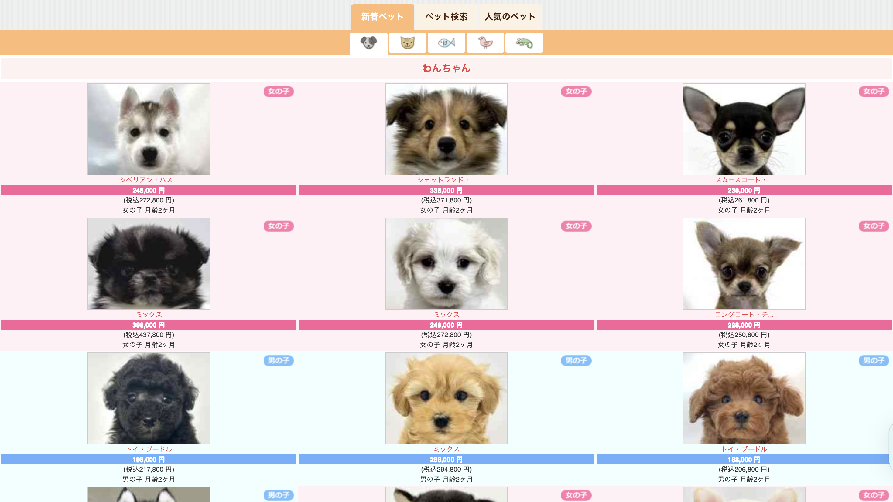
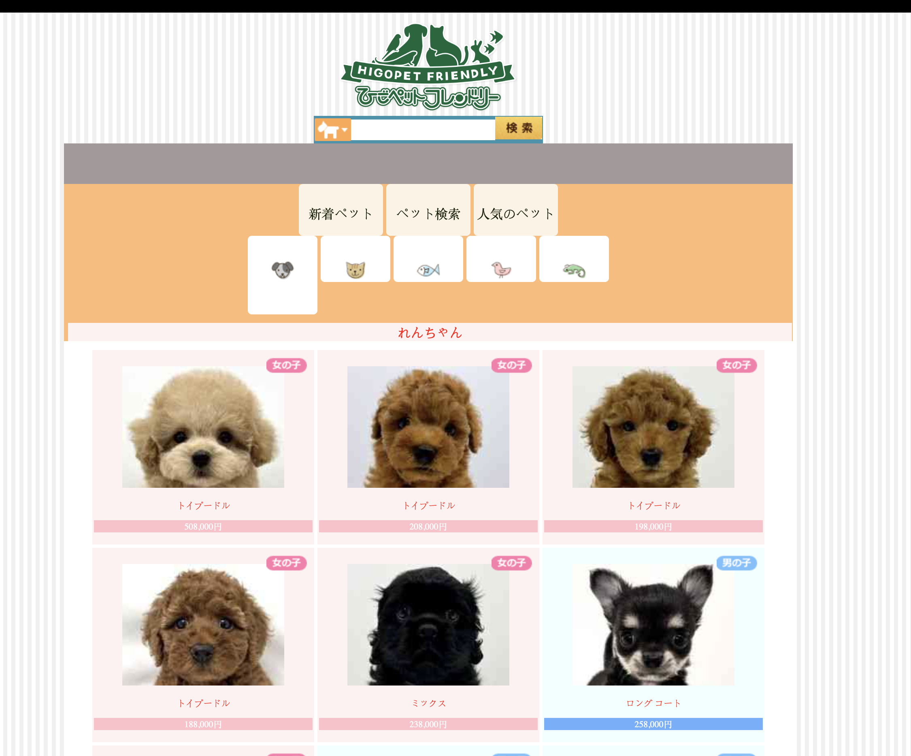
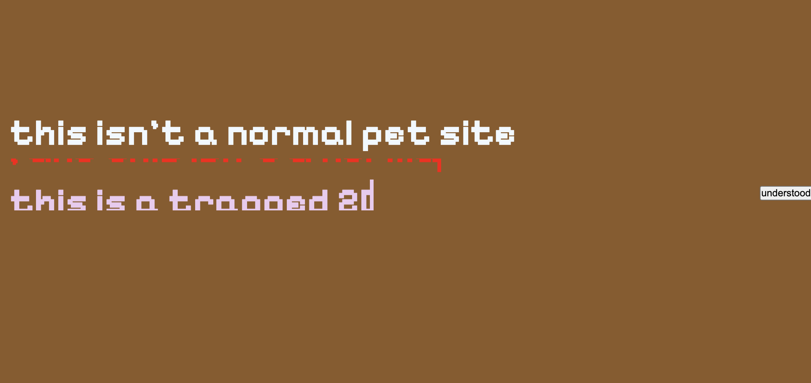
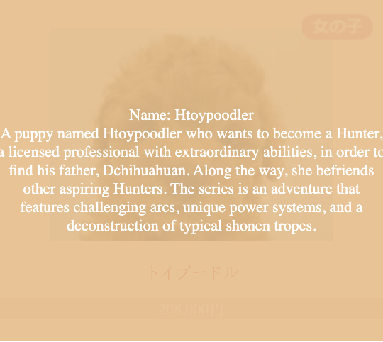
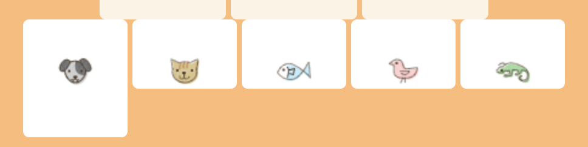
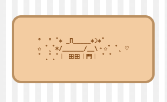
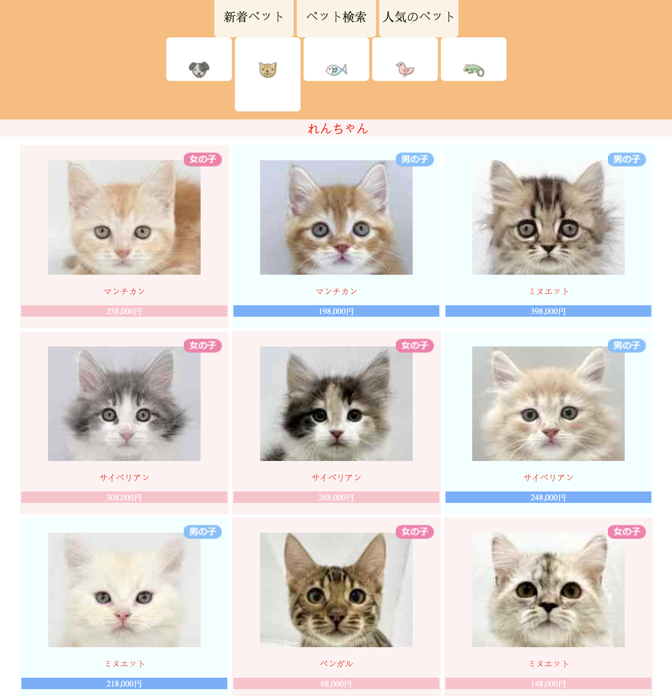
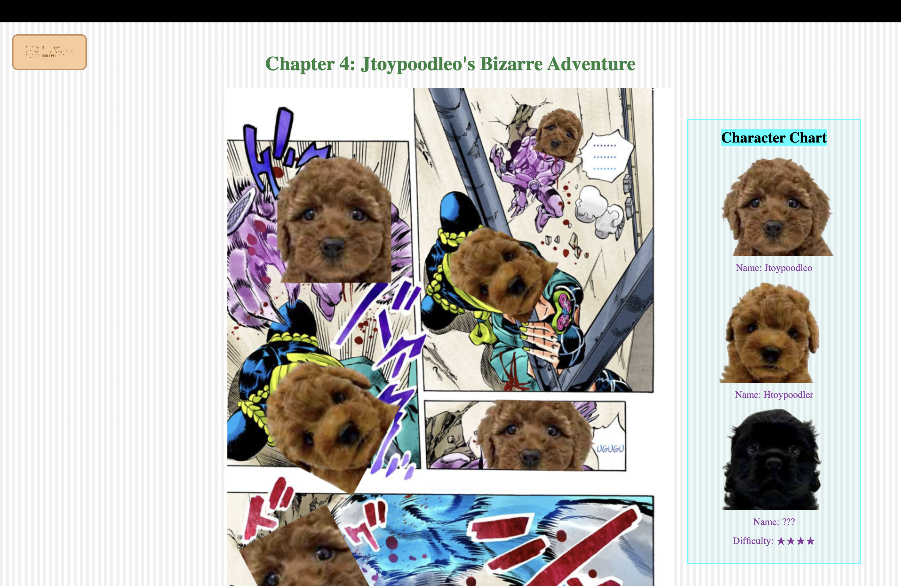
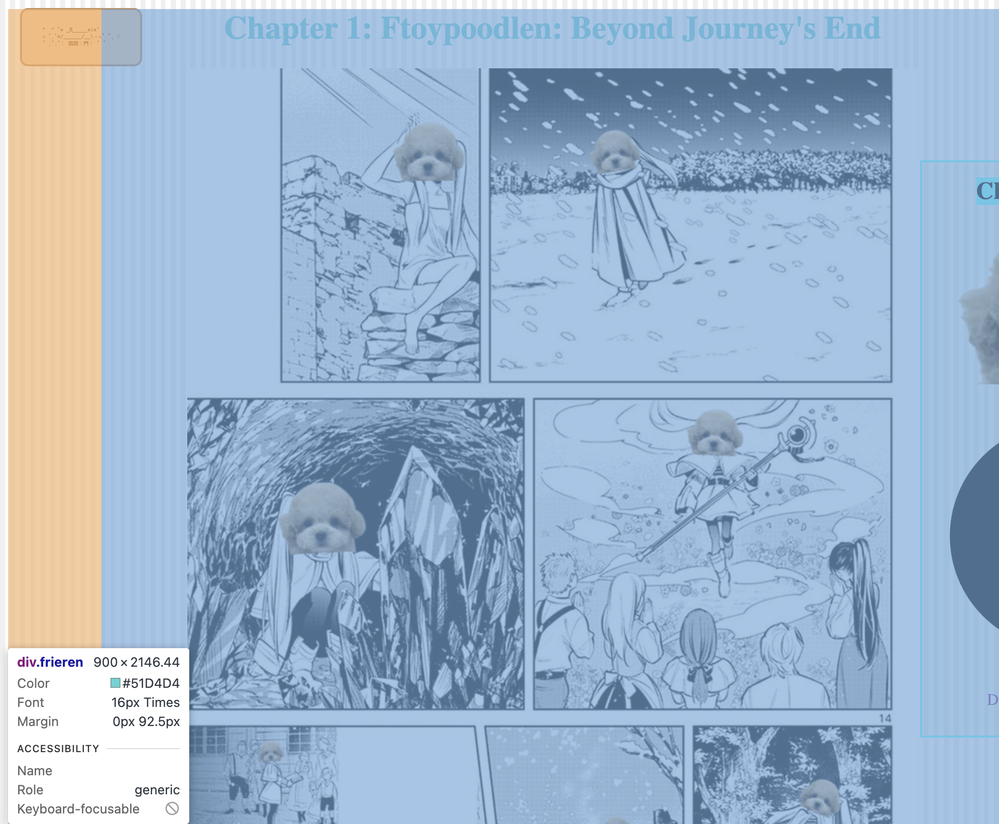
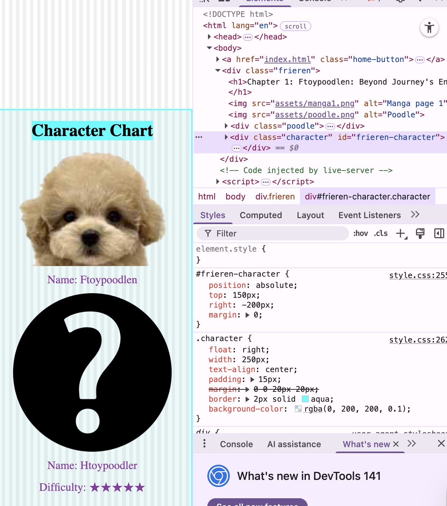

# Pet Story

## Design and Composition: Inspiration/Distortion

I copied the style of the pet website [Higopet](https://www.higopet.com/sp/), specifically their homepage. 

Because the first thing I see there is a dog, I decided to incorporate the same "dog page" when someone clicks into my site. 

I copied basically everything: the color, the pictures, and the format (like gender and breed). I even copied the logo at the top and the search bar so someone would think they really are on a real pet website. However, as they hover through the site, there are hidden buttons that reveal it’s not a normal website. For example, clicking the search button or the fish/reptile icon directs them to a "hint" page that gives a warning and instructions. 

As the user hovers over each dog's description, that text shifts into the story the dog will play a role in.

## Design and Composition: Gestalt Theory
Here I lean on **proximity** and **similarity** to first signal "this is a normal pet catalog," then break that expectation. The dog boxes sit very close to one another, so viewers naturally group them as the same set (proximity). Each box shares the same rectangular shape, color block, and internal structure like breed, image, gender, and price contained in one box, so users read them as interchangeable items (similarity). 
## Design and Composition: Web Interactions
I lean on small, familiar interactions to shift the tone. One detail I copied from the source is how, when the user taps an animal icon, the box extends in length, so they know what page they're on without needing to see the images underneath. 

I also added a Home button on every dog's story, so when the user isn't sure where to click, they can always return, look for more clues, or jump to a different chapter. 

Beyond that, I made many insignificant parts clickable and linked them to unrelated sites, adding moments of surprise and confusion. These micro-movements encourage the user to spend more time exploring. With so many subtle hints, they can always discover something they didn't expect.
## Technical: HTML hierarchy
### Main page (	`index.html`) — Dogs

Built around a few core containers:

- `.nav-item` shows the different animal icons so the user knows which page they're on.

- `.dog-item` is the main section with all the dog boxes and their introductions.

- Inside each dog box, smaller classes like `.gender girl`, `.blue`, and `.dog-price` slightly differentiate each dog.

- `.hover-text` is a div that reveals the different descriptions/stories on hover.

### Cat page(	`cat.html`) — Cats

- Copies the main page structure but replaces everything with cats (same layout/containers for consistency).

### Chapter page(1-9) (`chapterX.html`)

- Each chapter is short and simple.

- The largest wrapper class is usually named after the anime (e.g., `.frieren` for Chapter 1).

- Inside, a class like `.poodle` holds all the manga images.

- A `.character` box contains the character chart, with smaller IDs that correspond to each storyline.

### Hint page

- A focused layout that displays warnings/instructions when users click decoy UI (e.g., search, fish/reptile icon).
## Technical: CSS
layered manga + character chart on one page

For Chapter 1, I needed the manga images and a fixed character chart to coexist without pushing each other around. I did this by establishing a positioning context on the outer wrapper and combining float (for the chart's column) with absolute positioning (for chapter-specific pins/labels).

What's happening conceptually:

- `.frieren` is the chapter wrapper and uses `position: relative`; so all absolutely positioned elements inside (e.g., labels, next-chapter link) use it as their coordinate system.

- `.character` is the character chart. It floats right, forming a persistent sidebar box with an aqua border and darker blue background. This same pattern is reused for Chapters 1–9.

- `.frieren-character` items are absolutely positioned (top/right) so I can place them precisely next to relevant manga panels per chapter without affecting the document flow.

- `.poodle` (text that lead to the next chapter) is also absolute, positioned consistently within the .frieren box and updated per chapter.

- Smaller selectors (img, p, h2, mark) handle typographic and emphasis details without touching layout.
## Reflection and Future Development
## Credits & References
- [Youtube](https://youtu.be/qndys9v_Drg?si=KLnTzb27JxwrcSmP) & Google
- help from Leon & LA & my wonderful peers