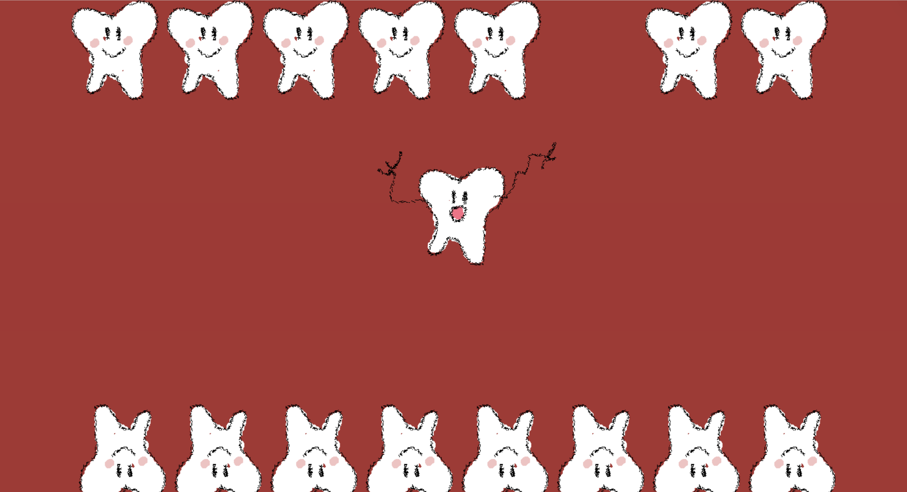
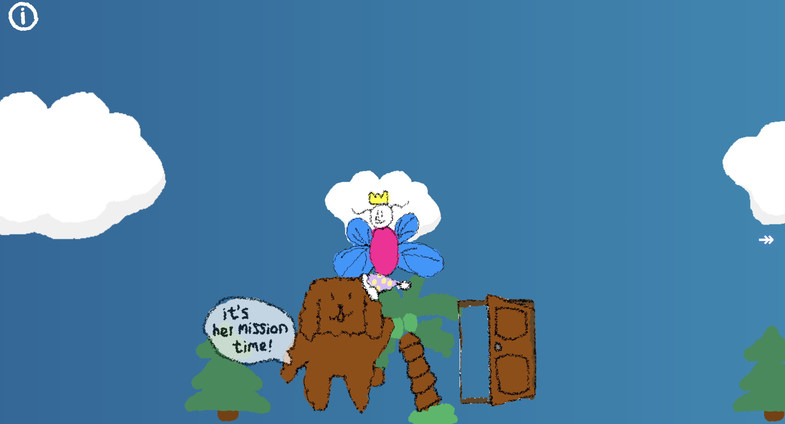
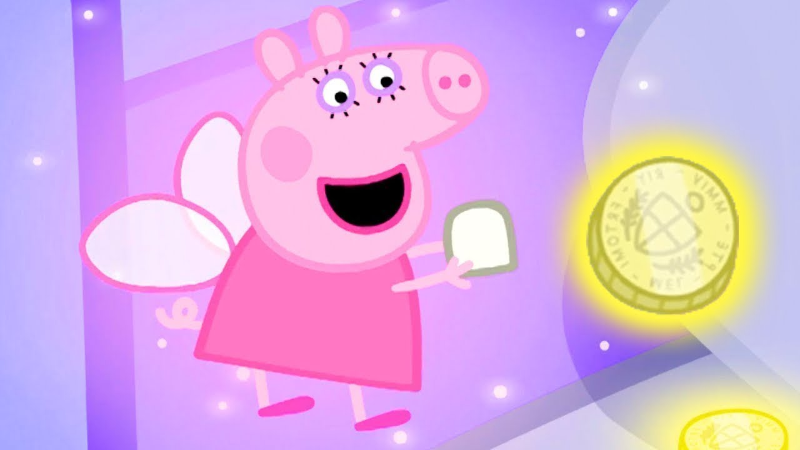
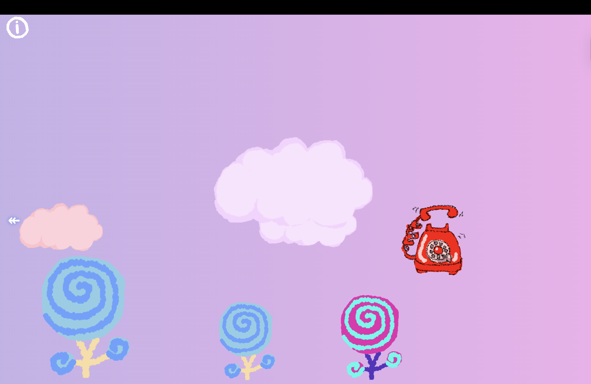
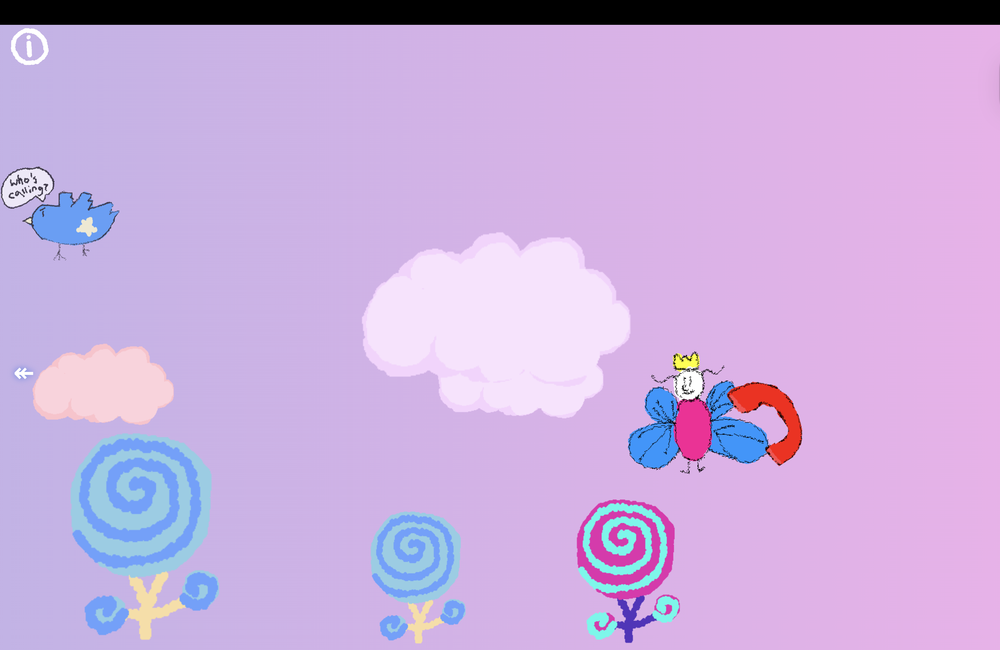
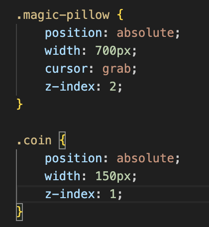
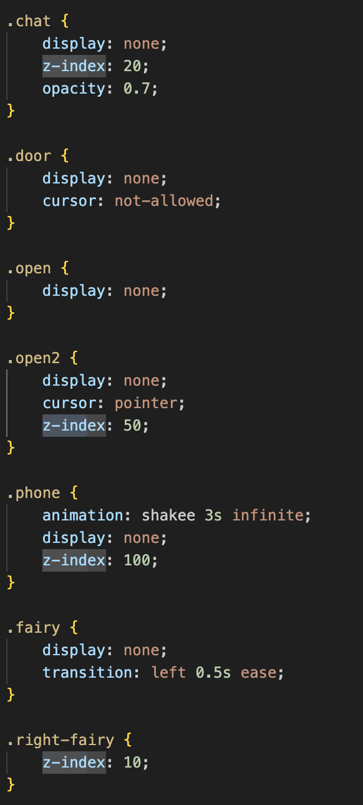
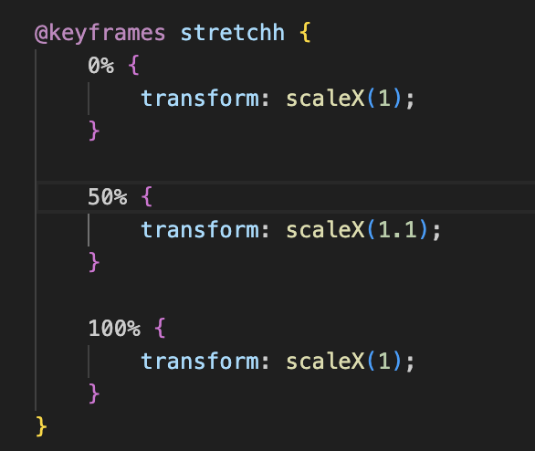
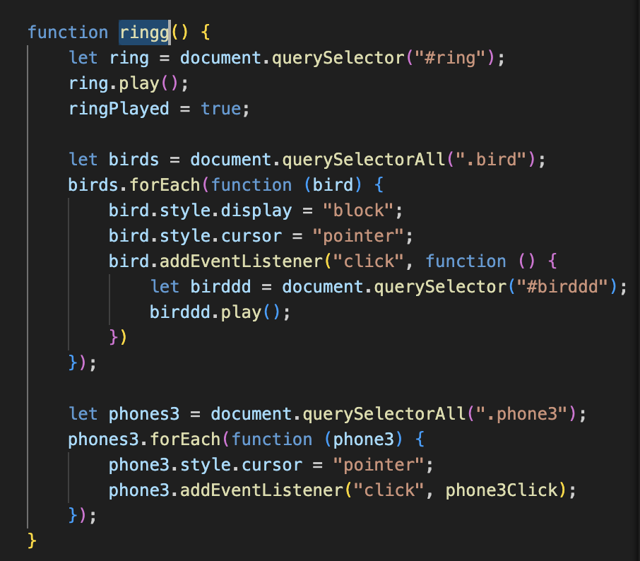

# When the Tooth Dropped 🦷

### by Angelina Chen
### When the Tooth Drops is a story adapted from the classic Tooth Fairy tale. It reveals the secret backstory of what happens every time a child loses a tooth.

When a child's loose tooth finally drops, the story begins inside the mouth, right at the moment of release. The tooth hits the floor,  grabbed, and put beneath a pillow, but it doesn't stay in the bedroom for long. Spotted by Cappu, the Tooth Fairy's #1 assistant, the fallen tooth triggers a shift into a parallel world: a candy-colored world where messages travel fast and magic is routine. From there, the Tooth Fairy follows the call back to the child's room, arriving to collect the tooth and transform it into a golden coin. 

 

## Design and Composition: 
My source is the classical Tooth Fairy story, filtered through a personal childhood ritual. When I was little, every time a tooth fell out, I stored it in a small tooth box and placed it under my pillow. By morning, the "Tooth Fairy" (my parents) would replace it with a 100 New Taiwan Dollar. I genuinely believed in the Tooth Fairy until before elementary school, and that belief transformed tooth loss from something scary into something I looked forward to. Because the original Tooth Fairy tale is so brief, I expanded it by adding backstory after discussing the idea with Professor Leon.

Rather than translating a specific "child character," I reinterpreted the entire story while removing a fixed child identity. I want the viewer to become the child again as they explore, perhaps stepping into their own memory. I also introduced an assistant character, Cappu, inspired by a dog I used to have and a recurring figure in my drawings. Cappu becomes the narrative bridge between the human bedroom and the Tooth Fairy's world.

I shaped the narrative through browser affordances, especially scrolling and sound. The story is intentionally paced through movement: scrolling builds anticipation, while sound suggests the change in settings. Even though the plot is simple, I designed it so each return visit can reveal something new, encouraging exploration. Sequence is also central for my work, that events don't unfold automatically. The viewer must trigger moments for the next scene to appear, which makes the user an active participant in the ritual. At the same time, I didn't want it to feel like a full game so I kept the structure legible as a website.

Visually and structurally, I rely heavily on reveal/hide mechanics (display: none/block) to let multiple characters or objects occupy the same space across different moments. Gestalt principles guide attention and navigation, especially similarity and anomaly. For example, on the first page, most teeth share the same smiling expression, while one tooth looks sad; that difference becomes a visual link that suggests where to click without explicit instruction. I use contrast in the environment the same way: backgrounds like trees and candy create a cohesive visual field, but a few objects break the pattern to trigger curiosity and invite interaction.
 
## Technical: HTML hierarchy
My project is organized as three linked HTML pages, each acting like a chapter:

- index.html (Tooth page): involves the tooth falling. The main narrative units are grouped into a few key classes: .teeth (upper teeth), .flip (bottom teeth), and .swirl (background layer).

- bed.html (Journey page): the most complex page, built like a scrollable story-space with multiple interactive zones. I separated elements into:

* .info (guides the user to character/context)

* .pillowcase (first window that invites interaction and initiates progression)

- Atmospheric background elements that create depth but don't change the main story flow: .tree, .cloud, .candy, etc. All are lightly interactive to reward curiosity.

- Character/trigger elements: .bird, .cappu, etc. Clicking these can reveal hints, unlock states, or trigger the next event.

- magic.html (Coin transformation): simplified ending page with only a few essential elements: .magic, .coin, .pillow.

This structure lets the story feel like progressing through rooms, but still keeps each chapter readable and manageable in code.
## Technical: CSS
Even though the narrative is short, I wanted the world to feel interactive, so my CSS is built around:

- Absolute positioning (especially in bed.html): because there are many layered elements on one long horizontal/scroll space, I used position: absolute to place objects precisely like stage props. 
 

- Visual hierarchy through scale + layering: foreground characters (z-index) and placed in clearer positions; background items are spaced randomly to form atmosphere and guide direction.
 

- Animation + transitions: I used many small animations to create a magical rhythm (floating, stretching)
 

- Interaction cues via cursor styles: I used cursor like cursor: pointer and cursor: grab to teach interaction without heavy instructions, so the user finds what can be clicked or dragged by hovering.
## Technical: JS
**What it does for the story**

The Tooth Fairy's movement is a key storytelling moment: it makes the fairy feel alive. Instead of simply appearing at the destination, she travels with the viewer's scroll, which turns the user's navigation into a narrative force. It also creates surprise: the fairy slowly approaches Cappu and the doorway as the viewer continues exploring, like the world is responding to them.

**How it works technically**

This interaction is driven by state variables and a scroll event listener that updates the fairy's position.

- Initial setup

* The Tooth Fairy starts far to the right, using something like left: 960px as an initial value.

- Narrative "cause" triggers the movement

* I use a state like ringPlayed = true to indicate the "ring event" happened.

*  That unlocks the next layer (like showing the bird), and then a further trigger happens when the user clicks phone3.

- Click trigger sets movement mode

* phone3Click() plays a murmur sound, sets phone3Clicked = true, turns fairyMoving = true, and stores the starting scroll position.
 